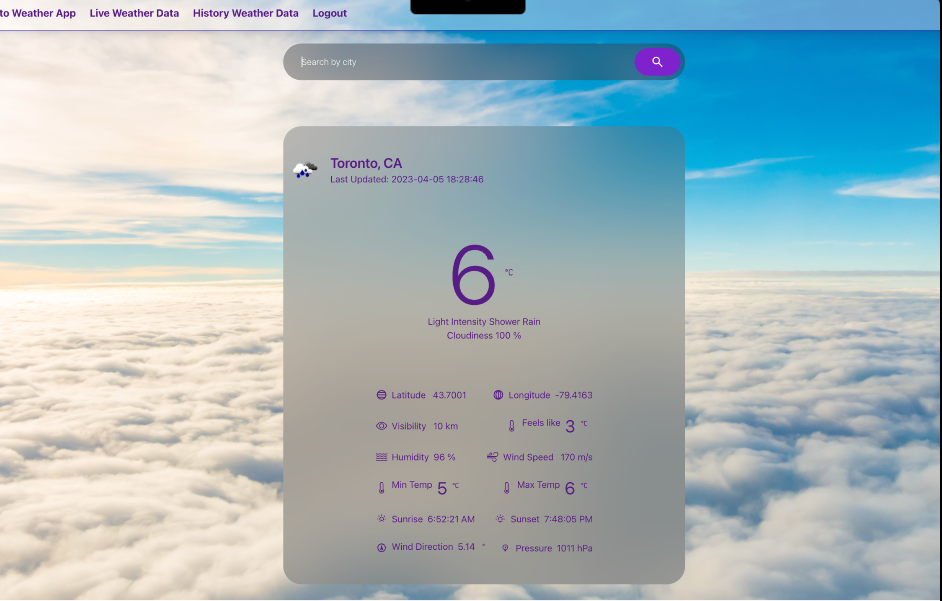

# Weather App Requirements
## MVP
### Functional Requirements:
- The weather app should include a sign-up feature that enables users to create an account by providing their first name, last name, username, phone number, email, and password.
- The application should send a verification email to the user's registered email address upon successful registration. This email should contain a verification link that the user must click on to confirm their email address and activate their account.
- The weather app should also have a sign-in feature that allows users to access their account by entering their username and password.
In case of a password reset request, the weather app should send a password reset email to the user's registered email address.
- Additionally, the weather app should include a logout feature that enables users to log out of their account.
By default, the weather app should display the current weather data for Toronto. However, it should allow users to search for and retrieve the current weather data for any city of their choice.
- The weather app should display the current temperature, humidity, wind speed, and weather conditions, such as sunny, cloudy, or rainy, for the selected city.
- To ensure accuracy and reliability, the weather app should retrieve the current weather data from a reputable and up-to-date weather API.
- To enable users to view their weather search history, the system should store the weather data for each city searched in a dedicated weather history record table.
- Moreover, the weather app should be capable of updating the weather data for the selected city at regular intervals.
### Non-functional Requirements:
- The system should aim for minimal latency to ensure fast response times.
- The system should also prioritize high availability, ensuring that it remains accessible and operational at all times.
- When displaying weather history records, the application should aim to do so within 1 second and limit the retrieval of records to the 10 most recent at a time.
- To ensure security, the application should use a token mechanism to authenticate and authorize user access.
- Sensitive user data, such as passwords, should also be encrypted to provide additional protection against unauthorized access.

## Feature Branch ? 
- SignUp, Register, Thanks for signing up

- SignIn Feature

-Forget Password, Reset Account Password

- Logout 

- Weather App display (temp, wind speed, etc); City

- Weather search history

